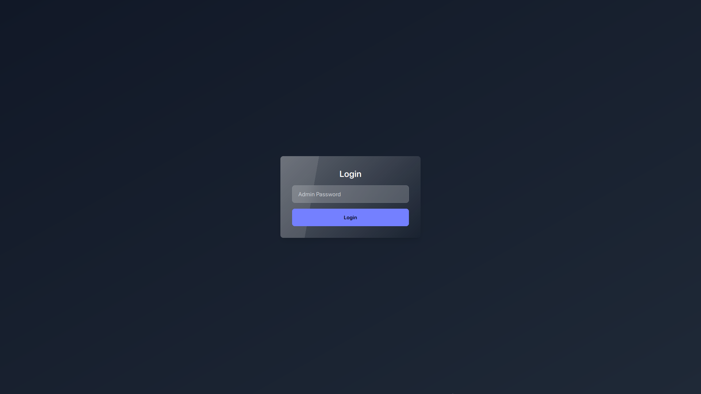
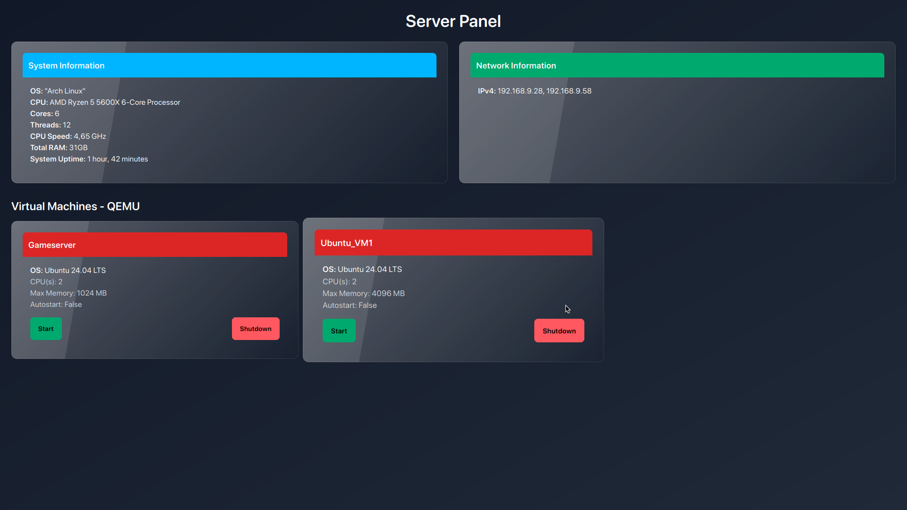

# Server Control Panel


A modern and sleek Server Control Panel built using **C# Blazor** and **DaisyUI**, featuring a **blurred glass effect** for a visually stunning user interface. This control panel allows administrators to manage server settings, monitor server status, and access other crucial features in an intuitive way.

## Screenshots

### Desktop View



## Features

- **Modern UI**: Utilizes DaisyUI for a clean, responsive design with a blur-glass effect that gives the panel a contemporary and attractive look.
- **Server Management**: Easily access information about your server, and control virtlib VMs.
- **Responsive Design**: The panel adapts to any screen size, providing a smooth experience on both desktop and mobile devices.
- **User Authentication**: Secure login to ensure only authorized users can access the control panel.
- **Customizable Settings**: Easily modify the control panel settings through the `settings.json` configuration file.

## Technologies Used

- **C#**: Core backend logic for server management.
- **Blazor**: Framework for building the interactive web UI.
- **DaisyUI**: Tailwind CSS plugin for modern and customizable UI components.
- **TailwindCSS**: Utility-first CSS framework used for styling.

## Customizing the Control Panel

The behavior and appearance of the control panel can be customized through the `settings.json` file located in the project root directory.

Here is an example of a typical `settings.json`:

```json
{
  "panel_title": "Server Panel",
  "password": "testpassword",
  "vms": [
    {
      "name": "Gameserver",
      "os": "Ubuntu 24.04 LTS"
    },
    {
      "name": "Ubuntu_VM1",
      "os": "Ubuntu 24.04 LTS"
    }
  ]
}
